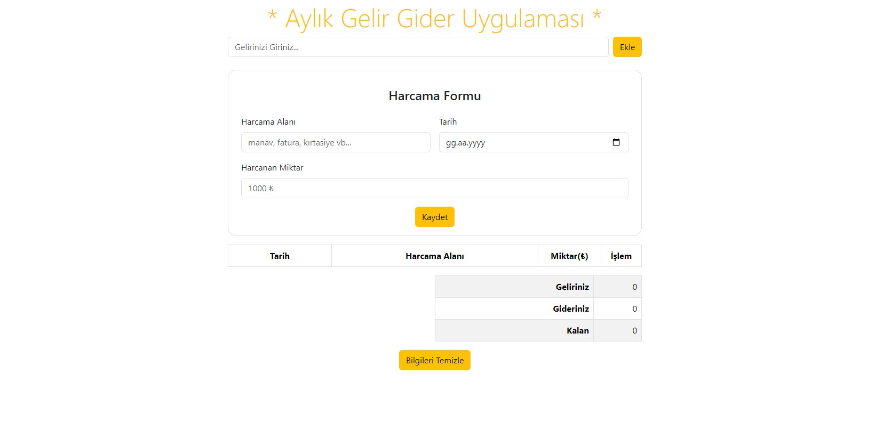
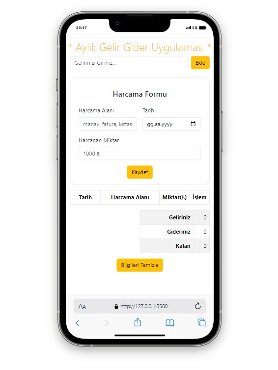

# Monthly Income and Expense Tracker Application

This project is a simple web application for tracking monthly income and expenses.
## Screenshots




## Technologies Used

- HTML
- CSS (Bootstrap 5.3.2)
- JavaScript
- Font Awesome (for icons)

## Live Demo

[Live Demo](https://example.com)

## Project Overview

This application allows users to do the following:

- Enter income
- Add expenses by specifying expense name, date, and amount
- View a table with the option to delete each expense
- Display a summary table showing total income, total expenses, and remaining balance
- Clear all data, including income, expenses, and local storage

## File Structure

- `index.html`: HTML file containing the structure of the web page.
- `style.css`: CSS file used to style HTML elements.
- `app.js`: JavaScript file containing functionality for adding income, expenses, and updating the summary table.
- `README.md`: This file containing information about the project.
## Responsive design




## Installation

To run the project locally:

1. Clone the repository:

   ```bash
   git clone https://github.com/username/income-expense-tracker.git
